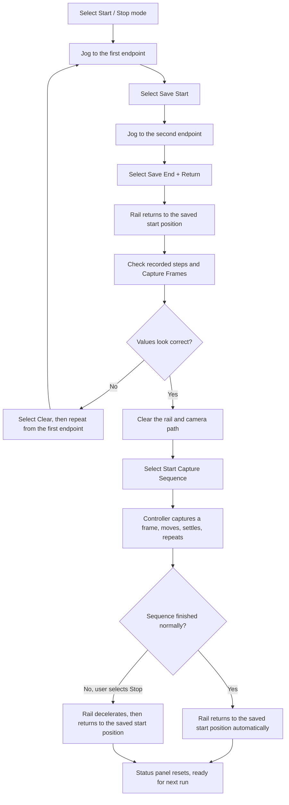

# MacroController

MacroController is an ESP32 focus-stacking controller for a motorized camera rail. It calculates a depth of field, moves a stepper motor between shots, triggers the camera, and provides a browser-based control panel. The TFT displays status and the controller address; configuration and controls are available in the web interface.

## Hardware

- ESP32 CYD board (the PlatformIO target is `esp32dev`)
- Stepper motor and compatible driver
- Motorized camera rail
- Camera trigger input and compatible trigger cable
- CYD 240 x 320 TFT display
- USB cable for programming and serial diagnostics

### GPIO assignments

| Function | ESP32 GPIO |
| --- | ---: |
| Camera trigger | 27 |
| Stepper pulse | 23 |
| Stepper direction | 18 |
| Stepper enable | 19 |
| TFT backlight | 21 |

The motor enable output is active-low. Confirm the driver's enable polarity and logic levels before connecting the motor.

## Build and upload

1. Open the project in VS Code with PlatformIO installed.
2. Copy [src/secrets.h.example](src/secrets.h.example) to `src/secrets.h`.
3. Set the Wi-Fi and fallback access-point values in `src/secrets.h`.
4. Connect the ESP32 by USB.
5. Run **PlatformIO: Build**, then **PlatformIO: Upload**.
6. Open the serial monitor at `115200` baud.

The firmware starts the web server during boot and prints its URL to the serial monitor. The same address is shown on the TFT.

## Network setup

By default, the controller joins the configured Wi-Fi network using DHCP. Optional static-IP settings are available in `src/secrets.h`.

If the station connection fails, or `WIFI_FORCE_AP` is set to `1`, the controller starts a fallback access point:

- SSID: `MacroController`
- Password: `macrocontrol`
- Address: `http://192.168.4.1/`

Connect a phone or computer to that access point and open the address above. Keep real Wi-Fi credentials out of version control.

## Web interface

The web interface updates every 500 ms and provides:

- Start and stop controls for a stacking run
- Camera trigger test
- Slow step, fast, and long manual movement in both directions
- Distance mode, which calculates shots from the configured travel distance (up to 60 mm)
- Start/stop mode, which calculates shots from recorded rail endpoints
- Macro lens, objective lens, and reverse lens calculation modes
- Sensor type, aperture, magnification, numerical aperture, tube length, focal length, delay, and sequence step fraction of DoF settings
- Live state, remaining shots, distance travelled, calculated step length, and calculated steps per shot
- Camera Test and Reset to Defaults controls

## Calculations

The controller calculates the capture spacing from the selected optical mode. In the table below, $M$ is magnification, $N$ is nominal aperture, $N_{eff}$ is effective aperture, $NA$ is numerical aperture, $c$ is the sensor circle of confusion in mm, and $S$ is the configured motor calibration in steps per micrometer.

| Calculation | Formula used by the controller | Notes |
| --- | --- | --- |
| Macro lens magnification | $M = M_{macro}$ | Uses the entered macro-lens magnification. |
| Microscope objective magnification | $M = M_{design} \times \frac{L_{actual} - 10}{L_{base} - 10}$ | The result is limited to $0.1$ through $100$. |
| Stacked-lens magnification | $M = \frac{f_{rear}}{f_{front}}$ | Rear focal length divided by front focal length. |
| Effective aperture: macro or stacked lenses | $N_{eff} = N \times (M + 1)$ | Uses the nominal aperture and calculated magnification. |
| Effective aperture: microscope objective | $N_{eff} = \frac{M}{2 \times NA}$ | Uses the calculated objective magnification and numerical aperture. |
| Circle of confusion | Full Frame: $c = 0.03$; APS-C: $c = 0.02$; Micro Four Thirds: $c = 0.015$ | Values are in mm. |
| Depth of field | $DoF_{\mu m} = \frac{2 \times c \times N_{eff}}{M^2} \times 1000$ | Rounded to the nearest integer micrometer value and limited to $1$ through $1,000,000$. |
| Motor steps per shot | $Steps_{shot} = round(DoF_{\mu m} \times F \times S)$ | $F$ is the configurable sequence step fraction of DoF (0.5-0.9, default 0.9). Rounded once to the nearest whole step and limited to $1$ through $1,000,000$ motor steps. |
| Step length | $Step_{\mu m} = \frac{Steps_{shot}}{S}$ | The distance the calculated integer step count actually produces, kept consistent with the real carriage motion. |
| Capture frames: Stacking Distance mode | $Distance_{\mu m} = Distance_{mm} \times 1000$; $Frames = \lceil \frac{Distance_{\mu m}}{Step_{\mu m}} \rceil$ | Converts the configured stacking distance from mm to micrometers, then divides it by the step distance. |
| Shots: Start/Stop mode | $Endpoint_{\mu m} = \frac{|Endpoint_{steps}|}{S}$; $Shots = \lceil \frac{Endpoint_{\mu m}}{Step_{\mu m}} \rceil$ | Divides the saved endpoint distance in motor steps by the calibration ($S$) to get micrometers, then uses the absolute distance between endpoints. |
| Estimated sequence time | $Time = Frames \times (Shutter + SettlingTime + \frac{Steps_{shot}}{100})$ | Capture moves run at 100 steps/s. The estimate covers each capture frame, shutter pulse, settling time, and its calculated stepper move. |

The calculated step length is shown in the status header and determines both the motor movement per shot and the total shot count.

### Distance mode

Set the travel distance, calibration value in steps per &#956;m, optical values, and delay. The controller calculates the number of shots using a step length equal to a configurable fraction of the depth of field (0.5-0.9, default 0.9), then returns the rail to its starting position when the run finishes.

Microscope objective mode defaults to an actual tube length of 160 mm. Adjust it when the measured tube length differs from the objective's marked base tube length.

```mermaid
flowchart TD
    A[Select Stacking Distance mode] --> B[Set Stacking Distance in mm]
    B --> C[Set Optical Mode and its values]
    C --> D[Set Steps / &#956;m calibration]
    D --> E[Set Settling Time]
    E --> F[Check Depth of Field, Step Length, and Total Capture Frames]
    F --> G{Values look correct?}
    G -- No --> C
    G -- Yes --> H[Clear the rail and camera path]
    H --> I[Select Start Capture Sequence]
    I --> J[Controller captures a frame, moves, settles, repeats]
    J --> K{Sequence finished normally?}
    K -- Yes --> L[Rail returns to start automatically]
    K -- No, user selects Stop --> M[Rail decelerates, then returns to start]
    L --> N[Status panel resets, ready for next run]
    M --> N
```

### Start/stop mode

1. Select **Start / stop** mode.
2. Use the jog controls to move to the first endpoint.
3. Select **Save start**.
4. Jog to the second endpoint.
5. Select **Save end + return**. The controller records the travel and returns to the start.
6. Start the run.

## Operating checklist

1. Test movement with the camera and subject clear of the rail.
2. Confirm forward and reverse directions.
3. Verify the driver enable behavior and the rail's usable travel.
4. Test the camera trigger with the camera disconnected or protected from unintended exposure.
5. Check the calculated shot count and delay.
6. Start the capture only after the rail, camera, and subject are secure.

The TFT is a status display only. Use the browser interface for setup and control.

## Project layout

- `src/main.cpp` - Arduino setup and main loop
- `src/controller.*` - motion, capture state machine, and focus-stack calculations
- `src/web_server.*` - Wi-Fi setup and browser interface
- `src/display.*` - TFT status display
- `src/SpeedyStepper.*` - stepper motion support
